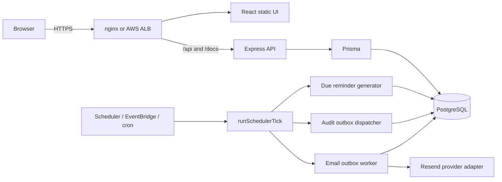
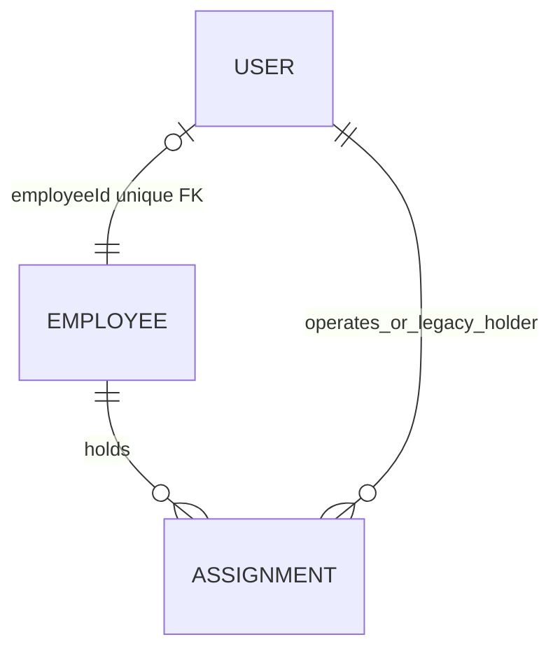

# Architecture — v1.1.0 Stable

RC2 คง modular monolith เดิมและเพิ่มเฉพาะ reliability boundary ที่พบจาก RC1

## Identity boundary

- `User` รับผิดชอบ login/JWT/RBAC และเชื่อม `Employee` แบบ optional one-to-one
- `Employee` คือ business identity ของผู้ถือครอง
- migration backfill เฉพาะอีเมล active ที่ไม่ซ้ำ; legacy rows ยังอ่านผ่าน `Assignment.userId`/email fallback

## Consistency boundary

- สร้าง Assignment: conditional `Asset AVAILABLE → IN_USE` และสร้าง Assignment ใน transaction เดียว
- ปิดคืน: Assignment และ `Asset → AVAILABLE|LOST|MAINTENANCE` อยู่ใน transaction เดียว
- partial unique index เดิมยังบังคับ active Assignment สูงสุดหนึ่งแถวต่อ Asset

## Reliability boundary

- Notification reminder ใช้ stable `dedupeKey` + unique index จึงปลอดภัยเมื่อ scheduler ทำซ้ำหรือชนกัน
- Audit event persist ที่ `AuditOutbox`; dispatcher ใช้ `AuditLog.outboxId` unique เพื่อ idempotency และ backoff retry
- `npm run scheduler` เป็น provider-neutral one-shot interface สำหรับ cron, Kubernetes CronJob หรือ ECS EventBridge
- Notification และ EmailOutbox ถูกสร้างใน transaction เดียวกัน; provider failure ไม่ย้อน workflow หลัก
- `EmailOutbox.dedupeKey` และ provider idempotency key ป้องกันส่งซ้ำ ส่วน FAILED ใช้ exponential backoff
- Notification email แยกจาก Login email, token ยืนยันเก็บเฉพาะ SHA-256 hash อายุ 20 นาทีและใช้ครั้งเดียว

## Network boundary

- TLS จบที่ AWS ALB หรือ self-hosted nginx
- nginx ใช้ resolver จาก container `/etc/resolv.conf` ตอนเริ่มระบบ ไม่ hardcode Docker DNS address
- Express trust proxy หนึ่ง hopใน production ทำให้ audit/rate limit เห็น client IP จริง
- database ไม่ publish สู่ public network; AWS secrets มาจาก Secrets Manager ไม่อยู่ใน task definition plaintext
